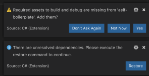

# Setup Boilerplate

## Clone the repository

The following command will clone **Boilerplate** code into a folder, open a terminal and enter the following command:

```bash
git clone https://github.com/AElfProject/aelf-boilerplate
```

The [**boilerplate repo**](https://github.com/AElfProject/aelf-boilerplate) contains a framework for easy smart contract development as well as examples (some explained in this series of articles).

## Build and run

### Open the project

If not already done, open vscode and open the **Boilerplate** folder. If asked to add some "required assets" say **yes**. There may also be some dependencies to restore: for all of them, choose **Restore**.



Open vscode's **Integrated Terminal** and build the project with the following command. Note: you can find out more about vscode's terminal [**here**](https://code.visualstudio.com/docs/editor/integrated-terminal).

As stated earlier, Boilerplate takes care of the C# code generation and thus has a dependency on protobuf. If you don't already have it installed, you can refer to the guide for [**manually install**](https://github.com/protocolbuffers/protobuf/blob/master/src).

### Build and run

The next step is to build all the contracts in **Boilerplate** to ensure everything is working correctly. Once everything is built, we'll run as below

```bash
# enter the Launcher folder and build 
cd chain/src/AElf.Boilerplate.Launcher/

# build
dotnet build

# run the node 
dotnet run --no-build bin/Debug/netcoreapp3.1/AElf.Boilerplate.Launcher
```

 When running **Boilerplate**, you might see some errors related to an incorrect password, to solve this, you need to backup your `data-dir/keys/` folder and start with an empty keys folder. Once you've cleaned the keys, stop and restart the node with the ```dotnet run``` command shown above.

At this point, the smart contracts have been deployed and are ready to be called (Boilerplate has a functioning API). You should see the node's logs in the terminal and see the node producing blocks. You can now stop the node by killing the process (usually **control-c** or **ctrl-c** in the terminal).

### Run tests

**Boilerplate** makes it easy to write unit tests for your contracts. Here we'll take the tests of the Hello World contract included in Boilerplate as an example. To run the tests, navigate to the **AElf.Contracts.HelloWorldContract.Test** folder and run:

```bash
cd ../../test/AElf.Contracts.HelloWorldContract.Test/
dotnet test
```
The output should look somewhat like this, meaning that the tests have successfully executed:
```bash 
Test Run Successful.
Total tests: 1
     Passed: 1
 Total time: 2.8865 Seconds
```

At this point, you have successfully downloaded, built, and run Boilerplate. You have also run the HelloWorld contract's tests that are included in Boilerplate. Later articles will show you how to add a contract and its tests and add it to the deployment process.

### Try code generator

#### Code generation

Navigate to **AElf.Boilerplate.CodeGenerator** folder and open `appsettings.json`, modify `Content` node, tune `New` values as you wish.

For example, if you want to develop a `NovelWritingContract`.

```
    "Contents": [
      {
        "Origin": "AElf.Contracts.HelloWorldContract",
        "New": "Ean.Contracts.NovelWritingContract"
      },
      {
        "Origin": "HelloWorld",
        "New": "NovelWriting"
      },
      {
        "Origin": "hello_world",
        "New": "novel_writing"
      }
    ],
```

Run the code generator and then you will find a `AElf.Contracts.NovelWritingContract.sln` in `aelf-boilerplate\chain`, you can use this sln to develop your own smart contract.

```bash
# enter the Launcher folder and build 
cd chain/src/AElf.Boilerplate.CodeGenerator/

# build
dotnet build

# run the node 
dotnet run --no-build bin/Debug/netcoreapp3.1/AElf.Boilerplate.CodeGenerator
```


#### Single node contract deployment

With `AElf.Contracts.XXContract.sln`, you can run project `AElf.Boilerplate.XXContract.Launcher` which is newly generated via above step, the `XXContract` will be automatically deployed in the block of height 2.

Check following code in `AElf.Boilerplate.XXContract.Launcher/DeployContractsSystemTransactionGenerator.cs`:

```
public async Task<List<Transaction>> GenerateTransactionsAsync(Address @from, long preBlockHeight,
    Hash preBlockHash)
{
    if (preBlockHeight == 1)
    {
        var code = ByteString.CopyFrom(GetContractCodes());
        return new List<Transaction>
        {
            await _transactionGeneratingService.GenerateTransactionAsync(
                ZeroSmartContractAddressNameProvider.Name, nameof(BasicContractZero.DeploySmartContract),
                new ContractDeploymentInput
                {
                    Category = KernelConstants.DefaultRunnerCategory,
                    Code = code
                }.ToByteString())
        };
    }

    return new List<Transaction>();
}

private byte[] GetContractCodes()
{
    return ContractsDeployer.GetContractCodes<DeployContractsSystemTransactionGenerator>(_contractOptions
        .GenesisContractDir)["AElf.Contracts.XXContract"];
}
```

You can customize code in `if` section to add more actions to deploy more contracts.

For example, you develop two smart contract using one generated sln: `XXContract` and `YYContract`, the deployment code should be like this:

```
public async Task<List<Transaction>> GenerateTransactionsAsync(Address @from, long preBlockHeight,
    Hash preBlockHash)
{
    if (preBlockHeight == 1)
    {
        var xxCode = ByteString.CopyFrom(GetContractCodes("AElf.Contracts.XXContract"));
        var yyCode = ByteString.CopyFrom(GetContractCodes("AElf.Contracts.YYContract"));
        return new List<Transaction>
        {
            await _transactionGeneratingService.GenerateTransactionAsync(
                ZeroSmartContractAddressNameProvider.Name, nameof(BasicContractZero.DeploySmartContract),
                new ContractDeploymentInput
                {
                    Category = KernelConstants.DefaultRunnerCategory,
                    Code = xxCode
                }.ToByteString()),
            await _transactionGeneratingService.GenerateTransactionAsync(
                ZeroSmartContractAddressNameProvider.Name, nameof(BasicContractZero.DeploySmartContract),
                new ContractDeploymentInput
                {
                    Category = KernelConstants.DefaultRunnerCategory,
                    Code = yyCode
                }.ToByteString())
        };
    }

    return new List<Transaction>();
}

private byte[] GetContractCodes(string contractName)
{
    return ContractsDeployer.GetContractCodes<DeployContractsSystemTransactionGenerator>(_contractOptions
        .GenesisContractDir)[contractName];
}
```

Don't forget to make sure these contracts are referenced by this `AElf.Boilerplate.XXContract.Launcher` project.

## More on Boilerplate

**Boilerplate** is an environment that is used to develop smart contracts and dApps. After writing and testing your contract on **Boilerplate**, you can deploy it to a running **AElf** chain. Internally **Boilerplate** will run an simplified node that will automatically have your contract deployed on it at genesis.

**Boilerplate** is composed of two root folders: **chain** and **web**. This series of tutorial articles focuses on contract development so we'll only go into the details of the **chain** part of **Boilerplate**. Here is a brief overview of the folders:

<!-- 
## chain  // root of the contract development folder
### src 
### contract 
#### AElf.Contracts.HelloWorldContract
##### AElf.Contracts.HelloWorldContract.csproj
##### HelloWorldContract.cs
##### HelloWorldContractState.cs
##### ...
### protobuf 
#### hello_world_contract.proto
#### ...
### test 
#### AElf.Contracts.HelloWorldContract.Test 
##### AElf.Contracts.HelloWorldContract.Test.csproj
##### HelloWorldContractTest.cs
### ...
-->

```
.
└── chain 
    ├── src 
    ├── contract
    │   └── AElf.Contracts.HelloWorldContract
    │       ├── AElf.Contracts.HelloWorldContract.csproj
    │       ├── HelloWorldContract.cs
    │       ├── HelloWorldContractState.cs
    │       └── ...
    ├── protobuf
    │   ├── hello_world_contract.proto
    │   └── ...
    ├── test 
    │   └── AElf.Contracts.HelloWorldContract.Test
    │       ├── AElf.Contracts.HelloWorldContract.Test.csproj
    │       └── HelloWorldContractTest.cs
    └── ...
```

The hello world contract and its tests are split between the following folders:
- **contract**: this folder contains the csharp projects (.csproj) along with the contract implementation (.cs files).
- **protobuf**: contains the .proto definition of the contract.
- **test**: contains the test project and files (basic xUnit test project).

You can use this layout as a template for your future smart contracts. Before you do, we recommend you follow through all the articles of this series.

You will also notice the **src** folder. This folder contains **Boilerplate**'s modules and the executable for the node.

All production contracts (contracts destined to be deployed to a live chain) must go through a complete review process by the contract author and undergo proper testing. It is the author's responsibility to check the validity and security of his contract. The author should not simply copy the contracts contained in **Boilerplate**. It's the author's responsibility to ensure the security and correctness of his contracts.

## Next 

You've just seen a short introduction on how to run a smart contract that is already included in **Boilerplate**. The next article will show you a complete smart contract and extra content on how to organize your code and test files.
