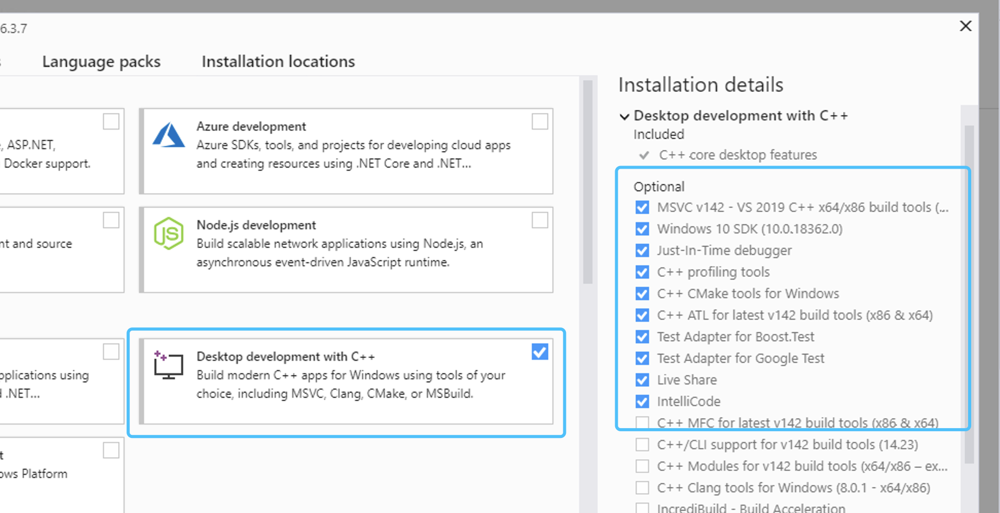
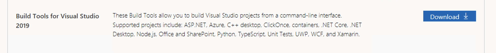
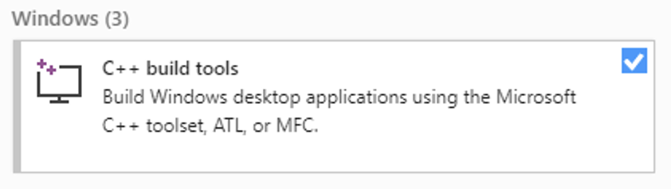
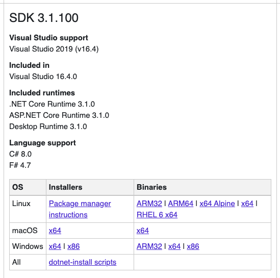

# Building sources and development tools

You only need to follow this section if you intend to build **AElf** from the sources available on Github or if you plan on doing smart contract development.

## Windows build tools

A dependency needed to build **AElf** from the command line under Windows is **Visual Studio Build Tools**. The easiest way is to use the **Visual Studio Installer**: 

If you already have an edition of **Visual Studio** installed, open the **Visual Studio Installer** and add the **Desktop development with C++** workload:



If you don't have any of the Visual Studio editions installed:

- you can download it here [**Visual Studio Community Edition**](https://visualstudio.microsoft.com/fr/downloads/?rr=https%3A%2F%2Fwww.google.com%2F) for free and after the installation add the **Desktop development with C++** workload.

- or if you don't need or want a full blown installation of **Visual Studio**, you can download the build tools here: [**Download Page**](https://visualstudio.microsoft.com/downloads/#other). Scroll down and under the section *Tools for Visual Studio 2019* download the build tools for Visual Studio:



 After the installation open **Visual Studio Installer**, locate and install the *C++ build tools*.



## Git

If you want to run a node or use our custom smart contract environment, at some point you will have to clone (download the source code) from **AElf** repository. For this you will have to use **Git** since we host our code on GitHub.

Click the following link to download Git for your platform (see here for more details [**Getting Started - Installing Git**](https://git-scm.com/book/en/v2/Getting-Started-Installing-Git)):

On macOS:
```bash 
brew install git
```

On Windows:
```bash
choco install git
```

On Linux:
```bash
sudo apt install git-all
```

## Development framework - dotnet core sdk

Most of **AElf** is developed with dotnet core, so you will need to download and install the .NET Core SDK before you start:

[**Download .NET Core 3.1**](https://dotnet.microsoft.com/download/dotnet-core/3.1)

For now **AElf** depends on version 3.1 of the SDK, on the provided link find the download for your platform (for Windows and macOS the installer for x64 is the most convenient if your platform is compatible - most are these days), the page looks like this: 



Wait for the download to finish, launch the installer and follow the instructions (for **AElf** all defaults provided in the installer should be correct).

To check the installation, you can open a terminal and run the ``dotnet`` command. If everything went fine it will show you ``dotnet`` options for the command line.

## Protobuf

Depending on your platform, enter one of the following commands (see here for more details [**Protobuf Github**](https://github.com/protocolbuffers/protobuf)):

On Windows, open a **Powershell** and enter the following commands:
```bash
choco install protoc --version=3.11.4 -y
choco upgrade unzip -y
```

On Linux:
```bash
# Make sure you grab the latest version
curl -OL https://github.com/google/protobuf/releases/download/v3.11.4/protoc-3.11.4-linux-x86_64.zip

# Unzip
unzip protoc-3.11.4-linux-x86_64.zip -d protoc3

# Move protoc to /usr/local/bin/
sudo mv protoc3/bin/* /usr/local/bin/

# Move protoc3/include to /usr/local/include/
sudo mv protoc3/include/* /usr/local/include/

# Optional: change owner
sudo chown ${USER} /usr/local/bin/protoc
sudo chown -R ${USER} /usr/local/include/google
```

on macOS:
```bash
brew install protobuf@3.11
brew link --force --overwrite protobuf@3.11
```