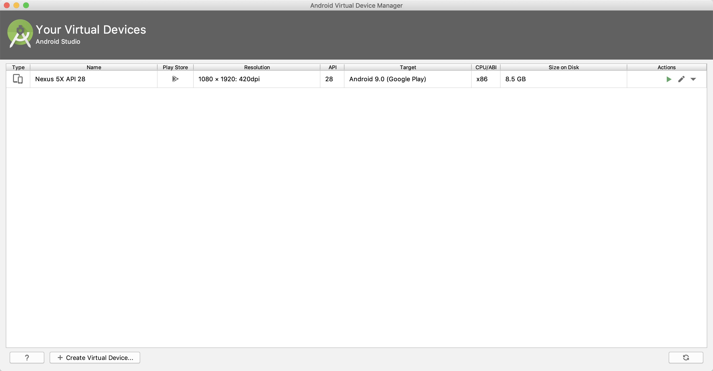

# Mac 下 iOS 与 Android 测试环境配置

## 1. Mac iOS

### 1. Install Xcode

`Xcode >= 9.4` [Click to download Xcode](https://developer.apple.com/xcode/downloads/)

## 2. Mac Android

如果你之前没有接触过 Android 的开发环境，那么请做好心理准备，这一过程相当繁琐。请万分仔细地阅读下面的说明，严格对照文档进行配置操作。
如果你是国内用户，请确保你可以科学上网。 如果不能科学上网，你可能无法成功搭建环境。请确保你的翻墙工具足够稳定，如果报错中出现网址，那么99.99% 是因为无法翻墙导致。
如果你和我一样使用的 ShadowsocksX 那么请切换为全局模式。

### 1. 安装 Android Studio

首先下载和安装 [Android Studio](https://developer.android.com/studio/index.html)，国内用户可能无法打开官方链接，请自行使用搜索引擎搜索可用的下载链接。安装界面中选择"Custom"选项，确保选中了以下几项

- Android SDK
- Android SDK Platform
- Android SDK Platform ([AMD 处理器看这里](https://android-developers.googleblog.com/2018/07/android-emulator-amd-processor-hyper-v.html))
- Android Virtual Device

```
    如果选择框是灰的，你也可以先跳过，稍后再来安装这些组件
```

### 2. 安装 Android SDK

Android Studio 默认会安装最新版本的 Android SDK。目前编译 React Native 应用需要的是```Android 9 (Pie)```版本的 SDK（注意 SDK 版本不等于终端系统版本，RN 目前支持 android4.1 以上设备）。你可以在 Android Studio 的 SDK Manager 中选择安装各版本的 SDK。

```
SDK Manager 可以在 Android Studio 的"Preferences"菜单中找到。具体路径是Appearance & Behavior → System Settings → Android SDK。
```
选中并安装以下内容

- Android SDK Platform 28
- Intel x86 Atom_64 System Image（官方模拟器镜像文件，使用非官方模拟器不需要安装此组件）

然后点击"SDK Tools"选项卡，同样勾中右下角的"Show Package Details"。展开"Android SDK Build-Tools"选项，确保选中了 React Native 所必须的28.0.3版本。你可以同时安装多个其他版本。

### 3. 配置 ANDROID_HOME 环境变量

React Native 需要通过环境变量来了解你的 Android SDK 装在什么路径，从而正常进行编译。

你需要把以下命令添加到  ```~/.bash_profile``` 文件中。

如果你的 ```~/``` 目录下没有 ```.bash_profile``` 文件，你可以创建它并编辑它

```bash
    vi ~/.bash_profile
```

```bash
    # 如果你不是通过Android Studio安装的sdk，则其路径可能不同，请自行确定清楚。
    export ANDROID_HOME=$HOME/Library/Android/sdk
    export PATH=$PATH:$ANDROID_HOME/tools
    export PATH=$PATH:$ANDROID_HOME/tools/bin
    export PATH=$PATH:$ANDROID_HOME/platform-tools
    export PATH=$PATH:$ANDROID_HOME/emulator
```

使用```source $HOME/.bash_profile```命令来使环境变量设置立即生效（否则重启后才生效）。可以使用```echo $ANDROID_HOME```检查此变量是否已正确设置。

```bash
    请确保你正常指定了 Android SDK 路径。你可以在 Android Studio 的"Preferences"菜单中查看 SDK 的真实路径，具体是Appearance & Behavior → System Settings → Android SDK。
```

### 4. 创建虚拟设备

打开 Android studio 在IDE右上角你可以找到红线标注的这个可爱的小图标，点击它。


你会看到如下画面



因为这里我已经创建过模拟器了，所以列表中已经有一台设备了，你可以点击 Create Virtual Device 创建一台模拟器。
因为模拟器很大，所以这一过程可能根据网络状况不同速度也不同。
